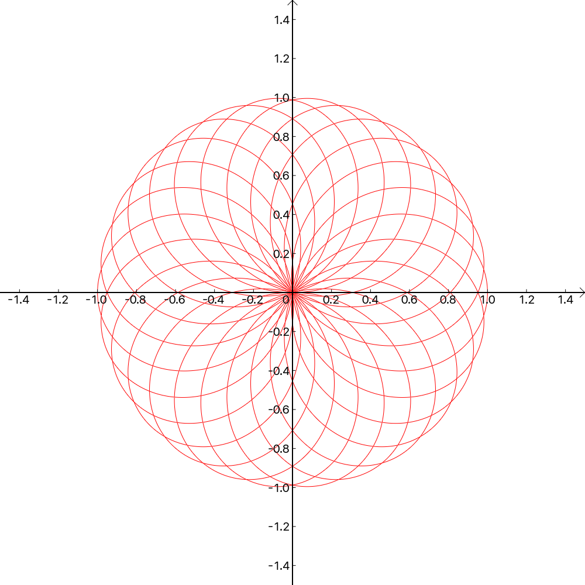

# OurPlot.cpp

## 编译说明

### Linux

```shell
git clone https://github.com/PhyX-Meow/OurPlot.cpp
cd ./OurPlot.cpp
bash build.sh
```

以上命令会在 `OurPlot.cpp/lib/` 目录下生成 `libplot.so`  
注：至少需要 c++11 标准支持

编译运行：假设 `main.cpp` 位于项目根目录下

```shell
g++ -Wall -O2 main.cpp -L./lib -lplot -o main.out
./main.out
```

### Windows

Working In Progress

## 使用说明

### 2d绘图

* 头文件

```cpp
#include "include/our_plot.h"
```

* 初始化画布

```cpp
canvas_2d c = canvas_2d(width, height, {x_min, x_max}, {y_min, y_max});
// Or equivalently
canvas_2d c(width, height, {x_min, x_max}, {y_min, y_max});
```

`width` 和 `height` 为正整数，分别指定画布的宽高，单位为像素  
`x_min, x_max, y_min, y_max` 为浮点数，指定画布中包含的坐标范围

* 直线

```cpp
line L({ini_x, ini_y}, {end_x, end_y}, color, style);
```

`ini_x, ini_y, end_x, end_y` 为起始点与终止点的横纵坐标  

端点也可以用极坐标方式指定

```cpp
line L(polar(r1,θ1), polar(r2, θ2), color, style);
```

`color` 为 `pix` 类型的变量，支持如下构造方式

```cpp
pix(red, green, blue); // red, green, blue integer in [0,255]
pix(0xRRGGBB); // standard hex color, R G B from 0 to F
RGB_f(red, green, blue); // red, green, blue real number in [0,1.0]
HSV(hue,s,v); // hsv color, hue integer in [0,360], s and v real number in [0,1.0]
```

头文件中包含如下预定义颜色变量

```cpp
const pix White(0xFFFFFF);
const pix Red(0xFF0000);
const pix Green(0x00FF00);
const pix Blue(0x0000FF);
const pix Cyan(0x00FFFFF);
const pix Purple(0xFF00FF);
const pix Yellow(0xFFFF00);
const pix Black(0x000000);
```

`style` 控制线条粗细，取值为 `thin, medium, thick`

* 一元函数

```cpp
func_1var fun(function, color, style, precis = 0.1, axe_type = X);
```

`function` 为 `double -> double` 的函数  
`precis` 为取样精度，数值越小精度越高，默认值为 `0.1`  
`axe_type` 取值为 `X` 或 `Y` 声明自变量是 x 或 y，默认值为 `X`  
`color` 与 `style` 含义同直线

* 极坐标函数

```cpp
func_polar pol(function, {θ_min, θ_max}, color, style, precis = 0.1);
```

`function` 为 `double -> double` 的函数
`θ_min, θ_max` 为 θ 的绘制范围
其余参数含义同一元函数

* 参数曲线

```cpp
func_para par(function, {t_min, t_max}, color, style precis = 0.1);
```

`function` 为 `double -> point` 的函数，返回值类型为 `point(double x, double y)` 代表平面中一个点  
`t_min, t_max` 为参数 t 绘制范围  
其余参数含义同一元函数

* 将曲线绘制到坐标轴上

支持类似 `cout` 的语法

```cpp
c << fun << pol << par;
```

可以直接绘制匿名曲线对象

```cpp
c << line({-1.9, -1.9}, {.8, 1.0}, 0x114514)
  << func_para([](double t) { return polar(1.0, t); }, {0, 2 * pi}, Black, thin);
```

* 绘制坐标轴

```cpp
c.draw_axes();
```

* 保存图片

```cpp
c.save_as("path/to/file");
```

`save_as` 可以接受 `string` 或者 `const char[]` 做参数，输出格式为 24-bit bmp

* 例：绘制一朵花

```cpp
#include "include/our_plot.h"

int main() {
    canvas_2d c(1000, 1000, {-1.5, 1.5}, {-1.5, 1.5});
    c.draw_axes();
    c << func_polar([](double t) { return sin(1.3 * t); }, {0, 20 * pi}, Red, thin, 0.01);
    c.save_as("flower.bmp");

    return 0;
}
```



### 3d绘图

因为 ddl 等原因，三维绘图功能尚不完善

* 初始化画布

```cpp
toy_3d c(width, height, scale);
```

`scale` 表示放大倍率，推荐设置 `width = 800, height = 600, scale = 1.0`，或这个参数比例的倍数

* 函数图像曲面

```cpp
surface sigma(function, color_function, precis = 0.1, mesh = 5);
```

`function` 是 z 关于 (x, y) 的函数，接受两个 `double` 参数，返回值为 `double` 类型  
`color_function` 指定如何对图像染色，接受 `point_3d` 为参数，返回值为 `pix` 类型  
其中 `point_3d` 类型的变量拥有三个成员 `x, y, z` 为它的三个坐标  
`precis` 为取样精度，数值越小精度越高  
`mesh` 为整数，指定每多少个取样点画一条网格线

* 参数曲线

Working In Progress

* 参数曲面

Working In Progress

* 例：绘制墨西哥草帽

```cpp
#include "include/our_plot.h"

double hat(double x, double y) {
    double r = std::sqrt(x * x + y * y);
    if (r < 1e-5)
        return 1.0;
    return std::sin(r) / r;
}

int main() {
    toy_3d c(1600, 1200, 2.0);
    c << surface(
        hat,
        [](point_3d p) { return HSV((1.0 - p.z) * 240.0, 1.0, 1.0); },
        0.1,
        5
    );
    c.save_as("c.bmp");

    return 0;
}
```


